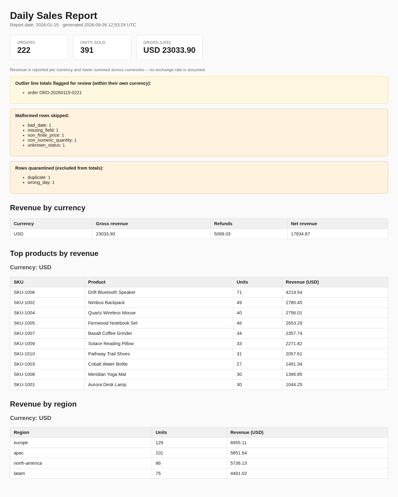
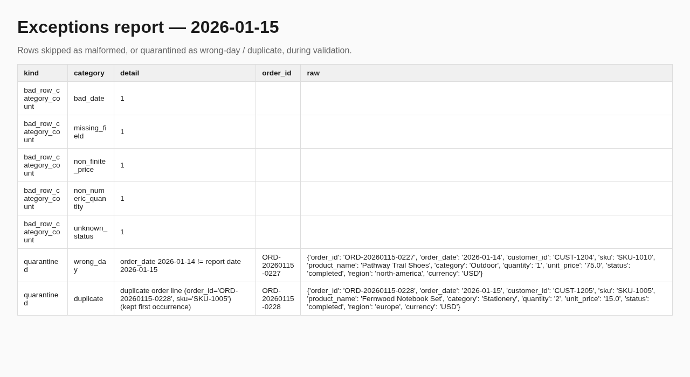

# CSV Daily Sales Report

A small, self-contained demo of a common freelance job: turn a nightly CSV
export into a validated daily report, unattended, with alerts when
something is wrong. All data in this repo is **synthetic**, generated by
`data/sample/generate_sample_data.py` with a fixed seed — no real orders,
customers, or company data.

## The problem this solves

A client has an order-export CSV landing daily (from a webstore, POS, or
warehouse system). They want, every morning, without anyone touching it:

- a readable daily sales report (revenue by currency, units, top products,
  by region)
- confidence that bad data (missing fields, duplicate order lines,
  wrong-day rows, malformed prices) didn't silently corrupt the numbers
- a separate exceptions report: full raw-row detail for quarantined rows
  (duplicates, wrong-day), category counts for malformed rows
- a scheduled run that survives a slow/missing input file (retry), and
  where a failed alert delivery makes the run itself fail so it gets
  retried instead of being silently swallowed
- an alert if the run fails, delivery fails, or the data looks off

## What it does

1. **Validate** (`src/data_loader.py`): schema check (required columns),
   type/range checks (quantity, price, status), and wrong-day filtering.
   Duplicate detection is on the **line** — `(order_id, sku)` — not
   `order_id` alone: an order legitimately has one row per distinct SKU,
   and two lines that share only the order_id are not duplicates. Malformed
   rows are skipped and categorized (counts only, not row identity);
   data-quality issues (duplicate lines, wrong day) are *quarantined* —
   kept out of the totals, and for these the full raw row is retained so
   the exceptions report shows exactly what was excluded and why.
2. **Flag outliers** (`src/report.py::compute_outliers`): line totals far
   outside the day's own distribution, compared only *within the same
   currency*, are flagged for review — they stay in the revenue totals
   (they may well be real), but show up as a callout.
3. **Report** (`src/report.py`): renders a daily HTML report (KPIs, top
   products, revenue by region, flags) and a CSV summary, all grouped by
   currency — **revenue is never summed across currencies**; there is no
   exchange-rate conversion anywhere in this tool. A multi-currency day
   shows one revenue figure per currency, not a blended total. All
   CSV-derived text is HTML-escaped before rendering — untrusted input
   never becomes markup.
4. **Exceptions report**: a CSV with per-category counts for malformed
   (skipped) rows, and one row per quarantined item (duplicate line,
   wrong-day) with its full original data and the reason.
5. **Schedule** (`deploy/`): a cron example and a systemd service+timer
   pair, both driving `src/run_daily.sh`.
6. **Retry, locking, and delivery-failure propagation**
   (`src/run_daily.sh`, `src/alert_state.py`): the wrapper retries a
   transient failure (input not mounted yet, or a failed alert delivery)
   with backoff, and takes an exclusive `flock` so an overlapping
   *scheduled* run skips instead of racing — the lock only protects runs
   that go through `run_daily.sh`; invoking `generate_report.py` directly
   bypasses it. Alert delivery is deduplicated per `(report_date,
   event_id)` **after a successful send only**, so a rerun of the same day
   does not re-notify on a condition that was already delivered, and a
   failed delivery is retried on the next run. This is **at-least-once**
   delivery, not exactly-once: a crash in the brief window between sending
   and recording that state (or a corrupted state file, which is treated
   as empty rather than blocking the run) can cause a duplicate
   notification. The dedup state does not distinguish the console stub
   from a real `NOTIFY_CMD` channel, so switching from the stub to a real
   channel with old state present can suppress that day's real alert until
   the state file is cleared.
7. **Failure alerts** (`src/alert.py`): a stub that prints the exact
   payload it would send; set `NOTIFY_CMD` to any executable that reads
   JSON on stdin (email, Slack webhook, PagerDuty, etc.) to wire a real
   channel — no code change needed. The CLI tracks every alert's delivery
   result: if any alert fails to send, `generate_report.py` prints
   `PARTIAL` (not `OK`) and exits non-zero, so `run_daily.sh`'s retry loop
   retries the whole run rather than treating a swallowed notification
   failure as success. There is no separate outbox/queue — a "retry" here
   means rerunning the report generator, which is safe because delivery
   state is only marked on success.

## Sample output

| Daily report | Exceptions report |
|---|---|
|  |  |

## Run it in 3 commands

```bash
python3 -m venv .venv && .venv/bin/pip install -r requirements.txt
.venv/bin/python data/sample/generate_sample_data.py --out data/sample/orders.csv --date 2026-01-15
.venv/bin/python src/generate_report.py --input data/sample/orders.csv --output-dir output --date 2026-01-15
```

Output lands in `output/`: `daily-sales-report-<date>.html`,
`daily-sales-summary-<date>.csv`, `exceptions-<date>.csv`.

To exercise the scheduled/retry/lock path directly:

```bash
SALES_INPUT=data/sample/orders.csv SALES_DATE=2026-01-15 src/run_daily.sh
```

Run the tests:

```bash
.venv/bin/python -m pytest tests -v
```

24 tests: schema/type validation per field, duplicate-line (not
duplicate-order-id) quarantine, a regression proving a multi-SKU order
keeps every line, per-currency revenue summarization (including a
two-currency fixture proving totals are never summed together),
per-currency outlier detection, HTML-escaping of untrusted CSV content,
CSV summary/exceptions writing, alert firing and idempotency (including a
simulated delivery failure), an end-to-end CLI run, and four subprocess
tests of the real CLI/`run_daily.sh` (lock contention, retry-then-escalate,
notifier-failure exit code, and the wrapper retrying after a notifier
failure).

## What a client gets

- The four source files in `src/`, readable and documented in place, not a
  black box.
- A report/exceptions pair for every run, so validation failures are
  visible, not silent.
- A scheduler snippet for their platform of choice (cron or systemd).
- A failure-alert hook that's trivial to point at their real channel.
- A test suite that documents the exact validation contract, runnable by
  their own team.
- A short runbook (below) for whoever owns this once it's handed over.

## Runbook

**Normal operation.** The timer/cron fires `src/run_daily.sh` once daily.
It writes `output/daily-sales-report-<date>.html`,
`-summary-<date>.csv`, and `exceptions-<date>.csv`, and appends to
`src/alerts.log` only when something needs attention.

| Symptom | Likely cause | Fix |
|---|---|---|
| No new files in `output/` after the scheduled time | Input CSV not present yet, or timer/cron not firing | Check `src/alerts.log` for a `CRITICAL`/`WARNING` line; check `systemctl list-timers` or `crontab -l` |
| `alerts.log` has `input_missing` | Upstream export job didn't land the file | Confirm the export job on the source system; rerun `run_daily.sh` once the file exists |
| `alerts.log` has `no_orders` | File exists but has zero usable rows for the date | Check the file wasn't truncated/empty upstream |
| `alerts.log` has `malformed_rows` | Some rows failed validation | Open `exceptions-<date>.csv`; malformed rows show as per-category counts, quarantined rows (duplicates/wrong-day) show the full original row |
| CLI printed `PARTIAL` and exited non-zero | Report was generated, but one or more alerts failed to deliver (`NOTIFY_CMD` failed) | Check `src/alerts.log`/stderr for which event id(s) failed; `run_daily.sh` will retry it |
| Report looks right but a rerun didn't re-alert | By design, for conditions that were already **successfully delivered** — dedup is per `(date, event_id)` in `state/alerts-<date>.json`, marked only on send success. A failed delivery is *not* marked and will be retried. Delete the state file to force re-delivery for testing. |
| Switched from the console stub to a real `NOTIFY_CMD` and a known alert didn't arrive | Old dedup state from the stub run can still be present and will suppress the real send | Clear `state/alerts-<date>.json` for that date before relying on the real channel |
| Two scheduled runs overlapped | `run_daily.sh` took the `flock`; the second one logs a `WARNING` and exits 0 without touching `output/`. This only protects runs made *through* `run_daily.sh` — a manual direct `generate_report.py` invocation is not locked. |
| `run_daily.sh` retried and still failed | Check `alerts.log` for the `CRITICAL` line with the final exit code; the underlying `generate_report.py` stderr is not captured by the wrapper — rerun it directly to see the traceback |

**Support boundary.** This repo is a bounded, reviewed automation: input
format, validation rules, and report layout as documented here. Changes to
any of those (new columns, a different alert channel, a different report
layout) are scoped change requests, not "support." No uptime/response-time
SLA is implied by this demo.

## Limits

- Single-file, single-day input (a *day's* orders in one CSV) — not a
  multi-file or streaming ingestion tool.
- The outlier flag is a simple stdev-based heuristic, not a fraud-detection
  system.
- The alert hook is a stub; a real delivery channel (SMTP, Slack, etc.)
  is a short, scoped integration on top of `NOTIFY_CMD`.
- No database — reports are files. Fine for daily cadence; not built for
  intraday/streaming volumes.
- This is a demo. A real engagement includes a discovery call to confirm
  the actual input schema before any code is written.

## License

MIT — see `LICENSE`.
